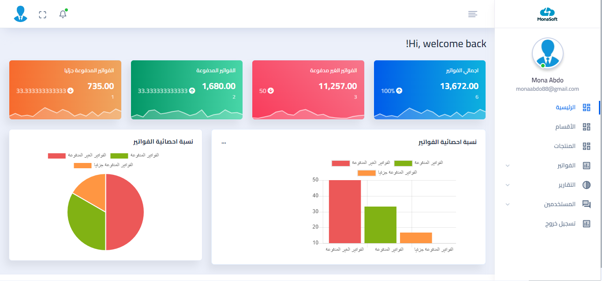
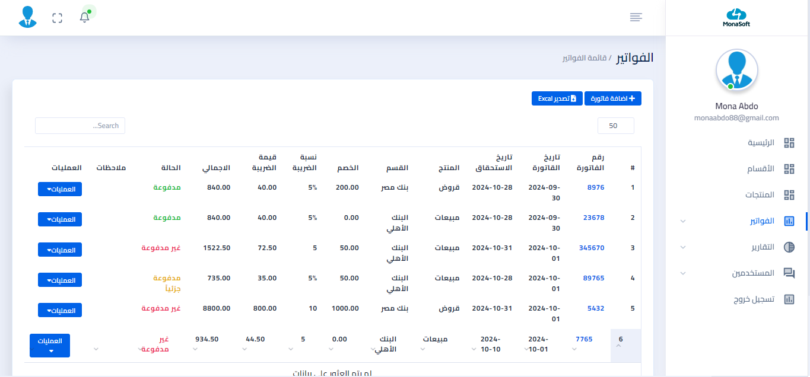

# Invoice Management System
The Invoice Management System is an application designed to help businesses create and manage invoices easily and efficiently. It allows for customized invoice generation, payment tracking, and detailed report creation.
# Features
<ul>
    <li>Create customized invoices.</li>
    <li>Send invoices via email.</li>
    <li>Manage clients and payments.</li>
    <li>Generate financial reports.</li>
</ul>

# Installation Steps:
git clone https://github.com/monaabdo88/invoices.git

cd invoices

# Packages
<table>
    <tr>
        <th>Package</th>
        <th>Verision</th>
    </tr>
    <tr>
        <td>icehouse-ventures/laravel-chartjs</td>
        <td>^4.1</td>
    </tr>
    <tr>
        <td>laravelcollective/html</td>
        <td>^6.4</td>
    </tr>
    <tr>
        <td>maatwebsite/excel</td>
        <td>3.1.47</td>
    </tr>
    <tr>
        <td>mckenziearts/laravel-notify</td>
        <td>^2.5</td>
    </tr>
    <tr>
        <td>spatie/laravel-permission</td>
        <td>^6.9</td>
    </tr>
</table>

# Preview

